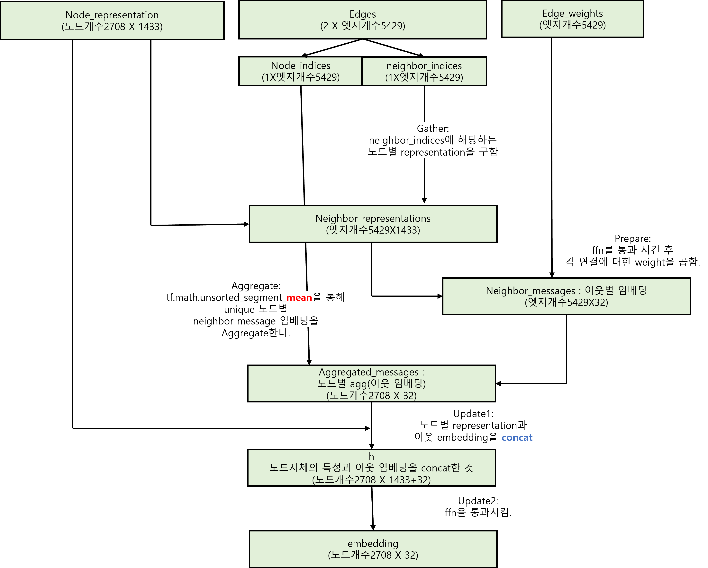
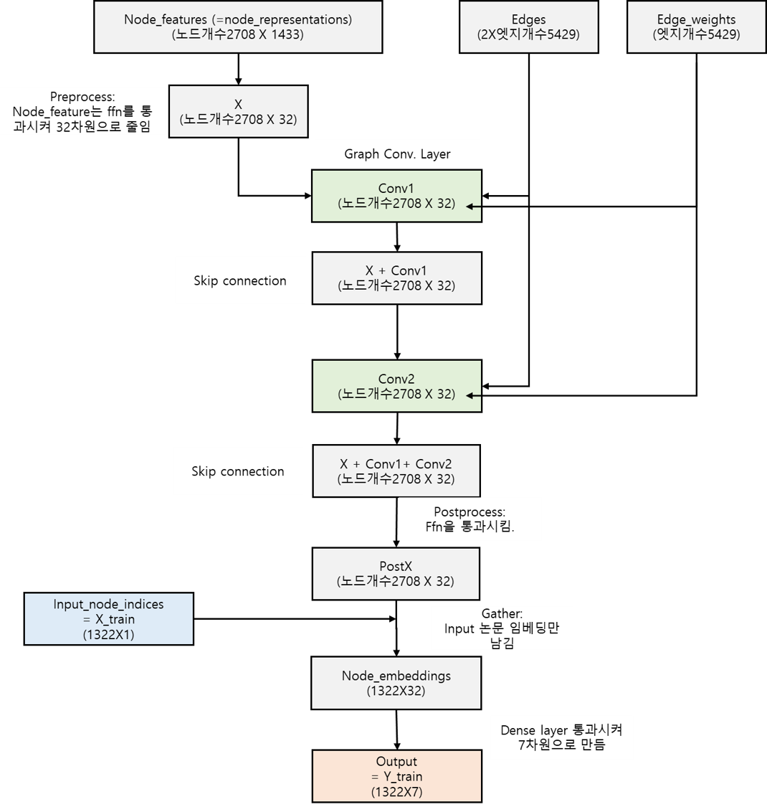

# gnn-implement

본 레파지토리는 https://keras.io/examples/graph/gnn_citations/#examine-the-gnn-model-predictions에 있는 graph neural network 모델을 구현한 것이다. 

## 파일 설명 

* Loader.py : 데이터 로드
* Model.py  : GNN 모델
* Run.py    : 실행하는 프로그램

## 데이터

* 논문의 주제(subject), 단어feature, 인용관계
* 출처: "https://linqs-data.soe.ucsc.edu/public/lbc/cora.tgz"
```
citations: [target논문인덱스, source논문인덱스]
papers: [논문인덱스, 1424개 단어 포함 여부, 주제(subject)]
train_data: papers 데이터 중 50% 샘플링
test_data: papers 데이터 중 50% 샘플링
x_train: train_data 중, 논문인덱스와 subject를 제외한 피쳐
y_train: train_data 중 subject에 해당하는 레이블
```


## 코드 실행 예시
```
python Run.py --epochs 100 --batch_size 256 --lr 0.01 --dropout_rate 0.5
```
```
python Run.py --epochs 10 --batch_size 32
```

- 결과: 샘플 테스트 데이터 결과를 프린트

```
sample test data :  tf.Tensor([1541   72 1250 2175 1756], shape=(5,), dtype=int64)

Instance 1:
- Case_Based: 0.02%
- Genetic_Algorithms: 0.01%
- Neural_Networks: 96.02%
- Probabilistic_Methods: 3.7%
- Reinforcement_Learning: 0.01%
- Rule_Learning: 0.0%
- Theory: 0.24%

Instance 2:
- Case_Based: 0.29%
- Genetic_Algorithms: 0.15%
- Neural_Networks: 1.22%
- Probabilistic_Methods: 0.57%
- Reinforcement_Learning: 0.07%
- Rule_Learning: 2.97%
- Theory: 94.74%

Instance 3:
- Case_Based: 0.3%
- Genetic_Algorithms: 98.44%
- Neural_Networks: 0.29%
- Probabilistic_Methods: 0.07%
- Reinforcement_Learning: 0.86%
- Rule_Learning: 0.03%
- Theory: 0.02%

Instance 4:
- Case_Based: 0.08%
- Genetic_Algorithms: 0.03%
- Neural_Networks: 0.84%
- Probabilistic_Methods: 0.32%
- Reinforcement_Learning: 0.01%
- Rule_Learning: 0.65%
- Theory: 98.06%

Instance 5:
- Case_Based: 0.01%
- Genetic_Algorithms: 0.04%
- Neural_Networks: 99.69%
- Probabilistic_Methods: 0.12%
- Reinforcement_Learning: 0.02%
- Rule_Learning: 0.01%
- Theory: 0.11%
```


## update

* Last Update Date: 2022/03/


## 도식

### Graph convolution layer


### Graph Neural Network

  